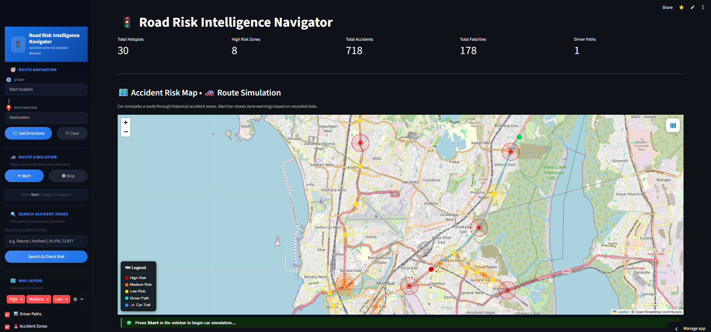
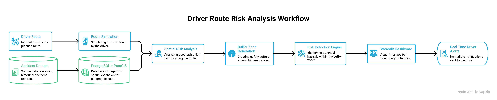

# 🚦 Road Risk Intelligence Navigator

### Real-Time Geospatial Accident Risk Monitoring & Driver Alert System


---

## 📸 Dashboard Preview



---

## 🎥 Project Demo

👉 **Watch Demo Video**


---

## 🏗️ System Architecture



---

## 📌 Project Overview

Road accidents remain a significant challenge for transportation systems and urban mobility planning. Drivers often lack awareness when approaching accident-prone locations, increasing the likelihood of collisions and unsafe driving conditions.

The **Road Risk Intelligence Navigator** is a geospatial analytics platform that combines **PostgreSQL, PostGIS, Python, Streamlit, and Leaflet** to identify accident hotspots, generate spatial risk zones, simulate driver movement, and provide intelligent real-time alerts when vehicles approach or enter hazardous areas.

This project demonstrates how spatial databases and GIS technologies can be used to build intelligent transportation and road safety solutions.

---

## 🎯 Project Objectives

* Store and manage accident hotspot data
* Calculate accident severity levels
* Generate spatial danger zones
* Simulate driver movement
* Detect entry into hazardous regions
* Provide real-time route risk alerts
* Visualize geospatial intelligence through an interactive dashboard

---

## 📊 Real-World Dataset

Unlike a synthetic or sample dataset, this project utilizes actual road accident records from Mumbai.

### Dataset Characteristics

- City: Mumbai
- Records Processed: 718+
- Accident Hotspots: 30
- Fatalities Analyzed: 178
- Geographic Coordinates Included
- Multi-Year Accident Statistics

### Attributes

- Accident Location
- City & Area Information
- Accident Counts
- Fatality Counts
- Latitude & Longitude
- Severity Index
- Risk Classification

The dataset was cleaned, validated, and converted into spatial geometries using PostGIS for advanced geospatial analysis.

## 🚀 Key Features

### 🛰️ Accident Risk Analysis

* Accident hotspot detection
* Severity index calculation
* Risk classification (High / Medium / Low)
* Spatial proximity analysis

### 📍 Spatial Buffer Zones

* 200-meter risk buffers
* PostGIS-based buffer generation
* High-risk area visualization

### 🚗 Driver Route Simulation

* Dynamic route generation
* Real-time vehicle movement simulation
* Route tracking and visualization

### 🚨 Intelligent Alert System

Automatic alerts when:

* ⚠️ Approaching danger zones
* 🚨 Entering accident-prone regions
* ✅ Leaving hazardous areas

### 🗺️ Interactive GIS Dashboard

* OpenStreetMap integration
* Leaflet visualization
* Dynamic risk mapping
* Interactive navigation tools
* Layer-based filtering

---

## 📈 Results

| Metric                       | Value |
| ---------------------------- | ----- |
| Accident Records Processed   | 718   |
| Accident Hotspots Identified | 30    |
| High-Risk Zones Detected     | 8     |
| Fatalities Analyzed          | 178   |
| Driver Routes Simulated      | 1     |
| Spatial Buffer Radius        | 200m  |

### Key Achievements

* Built a complete geospatial accident intelligence system
* Implemented PostGIS-based spatial analytics
* Generated dynamic risk zones using buffer analysis
* Developed real-time driver alert functionality
* Created an interactive GIS dashboard using Streamlit and Leaflet

---

## 🏗️ System Workflow

```text
Accident Dataset
       │
       ▼
PostgreSQL + PostGIS
       │
       ▼
Spatial Risk Analysis
       │
       ▼
Buffer Zone Generation
       │
       ▼
Driver Route Simulation
       │
       ▼
Risk Detection Engine
       │
       ▼
Streamlit Dashboard
       │
       ▼
Real-Time Driver Alerts
```

---

## 🛠️ Technology Stack

### Backend

* Python
* PostgreSQL
* PostGIS

### Geospatial Processing

* GeoPandas
* Shapely
* Geopy

### Visualization

* Streamlit
* Leaflet
* OpenStreetMap

### Data Handling

* Pandas
* SQL

---

## 🗄️ Spatial Database & PostGIS Features

This project leverages advanced PostGIS functionality for spatial intelligence and geospatial analytics.

### Core PostGIS Functions

```sql
ST_MakePoint()
ST_SetSRID()
ST_Buffer()
ST_DWithin()
ST_Intersects()
ST_Distance()
```

### Implemented Geospatial Capabilities

* Accident hotspot mapping
* Geometry creation from coordinates
* Spatial indexing using GiST
* Severity-based risk classification
* Buffer zone generation
* Driver route monitoring
* Proximity analysis
* Real-time alert generation

---

## 📂 SQL Components

| File                 | Purpose                                     |
| -------------------- | ------------------------------------------- |
| database_setup.sql   | Database creation and geometry generation   |
| spatial_analysis.sql | Risk analysis and spatial buffer generation |
| driver_alerts.sql    | Driver monitoring and alert generation      |

All SQL scripts are available inside the **sql/** directory.

---

## 📂 Project Structure

```text
road-risk-intelligence-navigator/
│
├── assets/
│   ├── dashboard.png
│   ├── architecture.png
│   └── Demo.mp4
│
├── sql/
│   ├── database_setup.sql
│   ├── spatial_analysis.sql
│   └── driver_alerts.sql
│
├── .devcontainer/
├── app.py
├── requirements.txt
├── README.md
├── LICENSE
└── .gitignore
```

---

## ⚙️ Installation & Setup

### 1. Clone Repository

```bash
git clone https://github.com/202519003/road-risk-intelligence-navigator.git

cd road-risk-intelligence-navigator
```

### 2. Install Dependencies

```bash
pip install -r requirements.txt
```

### 3. Enable PostGIS

```sql
CREATE EXTENSION postgis;
```

### 4. Execute SQL Scripts

Run the SQL files available in the `sql/` directory to create the database structure, spatial analysis workflow, and driver alert system.

### 5. Launch Application

```bash
streamlit run app.py
```

---

## 🌐 Dashboard Workflow

1. Load accident hotspot data
2. Calculate severity index
3. Classify accident risk levels
4. Generate 200m spatial buffers
5. Display accident risk map
6. Simulate driver movement
7. Detect zone intersections
8. Trigger intelligent alerts
9. Visualize route risk information

---

## 🔮 Future Enhancements

* Live GPS vehicle tracking
* Traffic data integration
* Accident heatmap generation
* Machine learning risk prediction
* Mobile notification support
* Cloud deployment
* Multi-city accident analysis

---

## 💼 Applications

This project can be applied in:

* Smart Cities
* Transportation Analytics
* Road Safety Monitoring
* Fleet Management
* Logistics Operations
* Emergency Response Systems
* Urban Mobility Planning
* Intelligent Transportation Systems (ITS)

---

## 👨‍💻 Author

### Mehul B Chaudhary

**M.Sc. Agriculture Analytics**

GIS | Spatial Analytics | Web GIS | Python | PostgreSQL | PostGIS

🔗 LinkedIn: [www.linkedin.com/in/mehulkumar-chaudhary-403516230](http://www.linkedin.com/in/mehulkumar-chaudhary-403516230)

🔗 GitHub: https://github.com/202519003

---

## ⭐ Support

If you found this project useful, consider giving the repository a ⭐ on GitHub.
